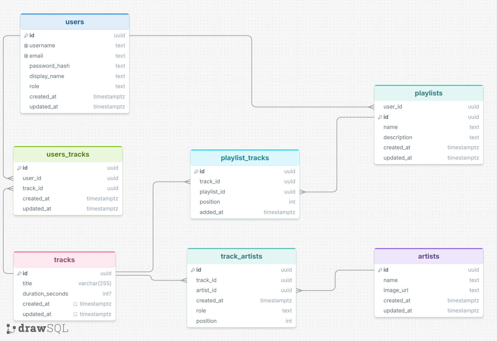

# Sonora

Sonora é um player pessoal de música desenvolvido como projeto de estudo, com foco em backend usando Java e Spring Boot.

O objetivo é construir uma aplicação completa para organizar e reproduzir uma biblioteca pessoal de músicas, com suporte futuro a playlists, favoritos, histórico de reprodução, streaming de áudio e integração com `yt-dlp` para importação de mídias autorizadas.

## Tecnologias

### Backend
- Java 21
- Spring Boot
- PostgreSQL
- Spring Data JPA
- Flyway
- Docker

### Mobile
- React Native
- Expo
- TypeScript

## Estrutura

```text
sonora/
├── backend/
├── mobile/
├── docker-compose.yml
└── README.md
```

## Modelo de dados



## Objetivo do projeto

O Sonora está sendo desenvolvido de forma progressiva para estudar e aplicar conceitos usados em projetos reais, como:

- APIs REST
- persistência com PostgreSQL
- migrations com Flyway
- Docker
- arquitetura backend
- mensageria assíncrona
- segurança
- testes
- observabilidade
- CI/CD

## Status

Em desenvolvimento.
